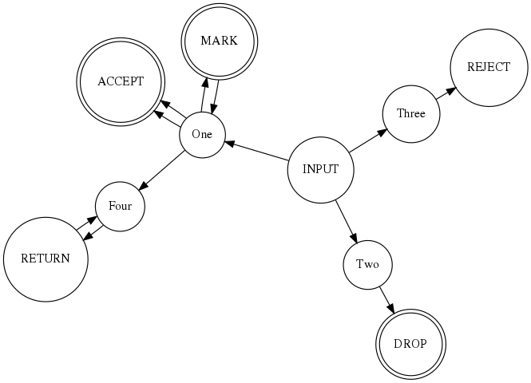

# fsm-iptables

Create a finite-state-machine diagram give the output from `iptables -L`

```
Usage:
  fsm-iptables [flags]

Flags:
      --config string   config file (default is $HOME/.fsm-iptables.yaml)
  -f, --file string     IPTables file to generate FSM from
  -h, --help            help for fsm-iptables
  -s, --start string    IPChain to start at. (default "INPUT")
  -t, --toggle          Help message for toggle
  -v, --verbose         verbose output
```



## Future Features and Enhancements 
1. Use rank to set rules, in a single chain at the same rank. i.e. 	{ rank=same ACCEPT DROP MARK }
1. Add flag to control depth of recursion, when following rules and chains.
1. Add flag to control displaying labels
1. For long inputs allow a lookup table and reference then via label
